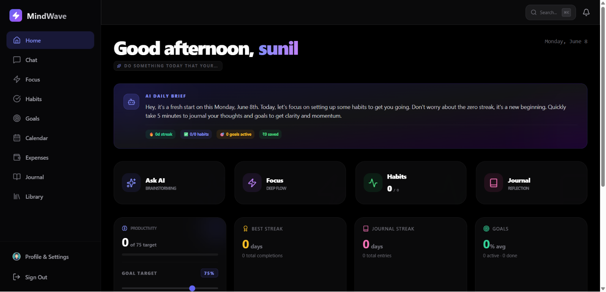

# MindWave

> Your AI-Powered Life OS

MindWave is a full-stack, self-hosted personal productivity platform that combines intelligent AI chat, habit tracking, smart goal planning, journaling, focus tools, and a financial operating system into a single cohesive interface. Built as a private "digital brain," it organizes your entire life while respecting your data privacy.

**The Problem It Solves**  
Modern productivity requires juggling a dozen disconnected apps—one for habits, one for finances, one for AI chat, and another for journals. This fragmentation causes friction and scatters personal data across multiple third-party servers.

**Why It Exists**  
MindWave exists to unify these workflows into a single, seamless environment where an intelligent AI has context over your goals, habits, and journals. It provides a premium, cohesive experience without sacrificing control over your data.

**Who It Is For**  
Developers, productivity enthusiasts, and privacy-conscious users who want a powerful, local-first life management system that they can fully own, host, and customize.

**Main Value Proposition**  
A completely private, extensible productivity OS featuring end-to-end encrypted journaling, offline-first mobile support, and multimodal AI capabilities—all running on your own infrastructure.

---

## Screenshots



> **TODO:** Add additional screenshots for Mobile View, Habit Tracker, and Financial OS.

---

## Key Features

### AI Features

**Intelligent AI Assistant & Personas**  
* **What it does:** Provides a customizable AI chat interface where you can select personalities (e.g., "Tough Love Coach", "Minimalist") and toggle between models like Llama 3.3 70B and DeepSeek R1 70B.  
* **Why it matters:** Adapts the system's tone and capabilities to your specific learning or productivity style.  
* **Implementation detail:** Dynamic system prompt injection and model switching routed through the Groq SDK.

**Multimodal Vision & Document Intelligence (RAG)**  
* **What it does:** Allows uploading images for analysis (e.g., Strava screenshots) and documents (PDF/TXT) for semantic search.  
* **Why it matters:** Transforms static files into queryable knowledge bases, letting you chat directly with your data.  
* **Implementation detail:** Uses Llama 4 Scout for vision, and local `@xenova/transformers` (`all-MiniLM-L6-v2`) to generate 384-dimensional embeddings stored and queried via cosine similarity.

**Interactive Tool Execution**  
* **What it does:** Allows the AI to autonomously update your dashboard (e.g., "Log a 5km run" updates the habit tracker).  
* **Why it matters:** Eliminates manual data entry by converting natural language into database operations.

### Productivity & Tracking

**Smart Goal Tracking**  
* **What it does:** Generates structured goal plans with milestones and visual timelines.  
* **Why it matters:** Breaks down overwhelming ambitions into actionable, trackable steps.

**Advanced Habit Tracker**  
* **What it does:** Monitors consistency with streak tracking, week-view heatmaps, and AI-driven performance insights.  
* **Why it matters:** Gamifies consistency and provides actionable feedback if you fall behind.

**Focus & Zen Timer**  
* **What it does:** Built-in Pomodoro timer with curated ambient soundscapes.  
* **Why it matters:** Keeps you in a flow state without needing an external app.  
* **Implementation detail:** Utilizes the native Web Audio API for procedural notifications.

### Data Management

**End-to-End Encrypted Journaling**  
* **What it does:** Secures journal entries before they leave your device, unlocking via biometric authentication.  
* **Why it matters:** Ensures your most private thoughts are unreadable to anyone—even if the database is compromised.  
* **Implementation detail:** Uses `crypto-js` for local encryption and Capacitor Biometric Auth for secure vault password retrieval.

**Financial OS**  
* **What it does:** A Bento Grid dashboard for tracking expenses, setting budgets, and visualizing cash flow.  
* **Why it matters:** Consolidates wealth management alongside your daily habits.

### Mobile & Performance

**Offline-First PWA**  
* **What it does:** Queues actions when offline and syncs them automatically when the connection is restored.  
* **Why it matters:** Ensures you can log data seamlessly, regardless of network conditions.  
* **Implementation detail:** Powered by Workbox Background Sync and Network-First caching strategies.

---

## Tech Stack

| Layer | Technology |
|---|---|
| **Frontend** | React 19, Vite, Tailwind CSS v3, Framer Motion |
| **Backend** | Node.js, Express 5 |
| **Database** | MongoDB (Mongoose 9) |
| **Authentication** | Custom JWT, Bcrypt, Capacitor Biometric Auth |
| **AI Inference** | Groq SDK (Llama 3.3, DeepSeek R1, Llama 4 Scout) |
| **State Management** | React Context, TanStack Query |
| **Styling** | Tailwind CSS, Lucide React, Recharts |
| **Mobile** | Capacitor v7, Vite PWA Plugin |
| **File Storage** | MongoDB GridFS |
| **Vector Search** | `@xenova/transformers` (Node.js) |
| **Security** | Helmet, express-rate-limit, express-mongo-sanitize |
| **Deployment** | Vercel (Client), Render/Railway (Server) |

---

## Architecture Overview

* **Frontend:** A React 19 Single Page Application built with Vite. It features a responsive layout utilizing Tailwind CSS, manages complex data states with TanStack Query, and leverages Service Workers for offline capabilities.
* **Backend:** A Node.js API powered by Express 5. It handles routing, middleware-based security, and orchestrates the AI pipelines.
* **API:** A RESTful architecture separating concerns (Auth, Chat, Goals, Habits, Expenses) with dedicated controllers and strict rate-limiting.
* **Database:** MongoDB acts as the central persistent store. Mongoose schemas validate all incoming data to maintain integrity.
* **AI Pipeline:** The backend coordinates local mathematical embedding generation (`@xenova/transformers`) with cloud-based LLM inference (Groq), handling RAG context injection before querying the model.
* **Authentication:** Stateless JWT tokens secure HTTP requests, while mobile clients use native secure storage (Keychain/Keystore) to manage encryption passwords via biometrics.
* **File Storage:** Uploaded PDFs and images are chunked and streamed directly into MongoDB using GridFS, enabling persistence on ephemeral PaaS environments.
* **Deployment Flow:** The decoupled architecture supports edge deployment for the static frontend and scalable Node environments for the API backend.

---

## Getting Started

### Prerequisites
* **Node.js:** v18 or higher
* **MongoDB:** A running instance (Local or Atlas)
* **Groq API Key:** Obtain from [console.groq.com](https://console.groq.com)
* **Git:** For cloning the repository

### Installation

**1. Clone the repository**
```bash
git clone https://github.com/sanjaikumarkaleeswaran/Mindwave.git
cd Mindwave
```

**2. Install Backend Dependencies**
```bash
cd server
npm install
```

**3. Install Frontend Dependencies**
```bash
cd ../client
npm install
```

### Environment Variables

Create a `.env` file in the `server` directory based on `.env.example`.

| Variable | Description |
|---|---|
| `PORT` | Backend server port (default: 5000) |
| `MONGO_URI` | MongoDB connection string |
| `JWT_SECRET` | Secret key for signing JSON Web Tokens |
| `GROQ_API_KEY` | API key for Groq AI inference |
| `EMAIL_USER` | SMTP email address for password resets |
| `EMAIL_PASS` | SMTP email password or App Password |
| `ALLOWED_ORIGINS` | Comma-separated list of permitted frontend URLs |

> **Note:** Never commit your `.env` file to version control.

### Running the Application

**Development Mode (Manual):**
1. **Backend:** In the `server` directory, run `npm run dev`.
2. **Frontend:** In a new terminal within the `client` directory, run `npm run dev`.

**Quick Start (Windows):**
Simply double-click the `start_app.bat` script in the root directory.

**Production Build:**
To build the frontend for production:
```bash
cd client
npm run build
```

---

## Folder Structure

```text
Mindwave/
├── client/                     # React Frontend (Vite)
│   ├── public/                 # PWA icons & manifest
│   ├── src/
│   │   ├── components/         # Reusable UI components (Sidebar, Modals, Cards)
│   │   ├── context/            # React Contexts (Auth, Theme)
│   │   ├── lib/                # API clients (Axios) and utility functions
│   │   └── pages/              # Main route views (Dashboard, Chat, Journal, etc.)
│   ├── tailwind.config.js      # Styling configuration and theme tokens
│   └── package.json
├── server/                     # Node.js Backend (Express)
│   ├── controllers/            # Request handlers and business logic
│   ├── middleware/             # Auth checks, Rate Limiting, Sanitization
│   ├── models/                 # Mongoose schemas (User, Goal, Habit, VectorChunk)
│   ├── routes/                 # API endpoint definitions
│   ├── utils/                  # AI orchestrators and VectorStore logic
│   └── index.js                # Server entry point
├── docs/                       # Additional documentation (e.g., RAG implementation)
└── README.md                   # Project documentation
```

---

## Usage Guide

* **Startup:** Launch both the backend and frontend servers. Open `http://localhost:5173` in your browser.
* **Login/Registration:** Create an account. Your data is isolated to your specific user ID.
* **Main Workflow:** Start your day on the **Dashboard** to view overdue milestones and daily habits. Use the **AI Chat** page to quickly log activities, query uploaded documents, or ask for habit insights.
* **Important Pages:**
  * **Habits:** Manage your daily routines and view consistency heatmaps.
  * **Goals:** Create structured plans. Use the AI generation tool to auto-build milestones.
  * **Journal:** Write encrypted daily reflections and receive automatic AI sentiment analysis.
  * **Expenses:** Track cash flow and manage monthly category budgets.

---

## API Overview

The backend exposes a secure RESTful API.

* **Authentication:** `/api/auth/register`, `/api/auth/login`, `/api/auth/verify`. Returns a JWT used in the `Authorization: Bearer <token>` header.
* **Main Endpoints:**
  * `/api/goals` - CRUD operations for goals and milestones.
  * `/api/habits` - Manage habits and log daily completions.
  * `/api/journals` - Securely store and retrieve encrypted journal entries.
  * `/api/chat` - Interact with the AI, trigger tool executions, or query RAG contexts.
* **Request Flow:** Client Request -> Rate Limiter -> XSS Sanitization -> Auth Middleware -> Controller -> Database/LLM -> Client Response.
* **Response Format:** Standardized JSON responses ensuring predictable error handling on the client.

---

## Database Overview

MindWave utilizes **MongoDB** for its schema flexibility and robust document storage capabilities.

* **Collections:** `Users`, `Goals`, `Habits`, `Journals`, `Expenses`, `Budgets`, `VectorChunks`.
* **Relationships:** All documents maintain a one-to-many relationship mapping back to a specific `User` via an `ObjectId` reference, ensuring strict data isolation.
* **Storage Strategy:** Standard text data is stored in standard collections. Binary files (PDFs, book covers) are stored directly inside MongoDB using **GridFS**, bypassing external bucket storage requirements.

---

## AI / ML Architecture

* **Models:** Relies on Groq for cloud inference, specifically targeting **Llama 3.3 70B** for general reasoning, **DeepSeek R1 70B** for complex logic, and **Llama 4 Scout 17B** for multimodal vision tasks.
* **Embeddings:** Generates embeddings completely locally using the `@xenova/transformers` library running the `all-MiniLM-L6-v2` model in Node.js.
* **Vector Search:** Custom Node.js cosine similarity algorithms query the `VectorChunks` collection to find relevant semantic matches.
* **RAG Pipeline:** When a document is uploaded, it is automatically chunked, embedded, and stored. Subsequent chats query this vector database to append highly relevant context to the LLM prompt.
* **Prompt Flow:** Supports custom User Personas that dynamically mutate the system prompt injected at the start of the message array.

---

## Security

* **End-to-End Encryption (E2EE):** Journal entries are encrypted on the client side using `crypto-js` before transmission.
* **Authentication:** Stateless JWTs with secure, HTTP-only cookie potential.
* **API Hardening:** Protected via `helmet` for HTTP headers and `express-rate-limit` to prevent brute-force attacks.
* **Input Validation:** Employs `xss-clean` and `express-mongo-sanitize` to actively prevent Cross-Site Scripting and NoSQL Injection vulnerabilities.

---

## Performance Optimizations

* **Network-First Caching:** PWA architecture aggressively caches API responses and static assets to ensure the dashboard loads instantly, even offline.
* **Background Sync:** Workbox queues failed mutations (like habit logs) during network drops and syncs them upon reconnection.
* **Render Optimizations:** Extensive use of React's `useMemo` and `useCallback` to prevent unnecessary re-renders of complex charts and grids.

---

## Mobile Experience

* **Responsive Design:** 2-column grids on mobile automatically expand to 4 columns on desktop.
* **Native Wrappers:** Fully configured with **Capacitor** to compile native `.apk` and `.ipa` binaries.
* **Mobile Navigation:** Utilizes a highly compact, touch-friendly 8-item bottom navigation bar.
* **Safe Area Support:** CSS variables (`env(safe-area-inset-*)`) ensure the UI gracefully handles iPhone notches and navigation bars.
* **Dynamic View Heights:** Employs `dvh` units for modals to prevent layout shifts caused by collapsing mobile browser toolbars.

---

## Deployment

* **Frontend:** Ready to be deployed as a static site on **Vercel** or **Netlify**. Ensure build command is set to `npm run build` and output directory is `dist`.
* **Backend:** Deployable as a web service on **Render**, **Railway**, or a VPS. Ensure the `PORT` environment variable is respected.
* **Database:** Best hosted on **MongoDB Atlas** for reliable uptime.
* **Environment Variables:** Must be securely injected into both the client (Vite `VITE_` prefix if applicable) and server deployment environments.

---

## Roadmap

- [x] AI Chat with habit/goal tool execution
- [x] True Vector RAG for document chat
- [x] End-to-End Encryption (E2EE) for Journals
- [x] Native Mobile App Wrappers (Capacitor)
- [x] Offline First Mode & Background Sync
- [x] Financial OS (Expense Tracker)
- [ ] Integration with External Calendars (Google/Outlook)
- [ ] Advanced Desktop Native App (Electron/Tauri)
- [ ] Push Notifications via Web Push API
- [ ] Multi-user team collaboration spaces

---

## Repository Guidelines

* **Files to Commit:** Source code, configuration files (`package.json`, `vite.config.js`), and documentation.
* **Files to Ignore:** `.env` files, `node_modules/`, `dist/`, and local temporary files.
* **Security Notes:** Never commit API keys, database credentials, or JWT secrets. Always utilize the provided `.env.example`.

---

## Contributing

1. **Fork** the repository.
2. **Branch:** Create your feature branch (`git checkout -b feature/AmazingFeature`).
3. **Commit:** Commit your changes (`git commit -m 'Add some AmazingFeature'`).
4. **Push:** Push to the branch (`git push origin feature/AmazingFeature`).
5. **Pull Request:** Open a Pull Request for review.

**Issue Guidelines:** Please ensure you describe the problem clearly and provide reproduction steps for any bugs.

---

## FAQ

**Q: Do I have to pay for the AI features?**  
A: No, MindWave uses the Groq API, which currently offers generous free tiers for inference. You just need to create an account and supply your own API key.

**Q: Can I run this completely offline without the internet?**  
A: The core application (habits, goals, expenses) will function using PWA caching, but AI inference requires an internet connection to reach the Groq API. 

**Q: Is my data safe?**  
A: Yes. MindWave is self-hosted, meaning the database lives entirely on your own infrastructure. Additionally, the Journal module utilizes End-to-End Encryption.

---

## License

Distributed under the MIT License. See `LICENSE` for more information.

---

## Author

**Sanjai Kumar Kaleeswaran**
* **GitHub:** [@sanjaikumarkaleeswaran](https://github.com/sanjaikumarkaleeswaran)
* **Project Link:** [https://github.com/sanjaikumarkaleeswaran/Mindwave](https://github.com/sanjaikumarkaleeswaran/Mindwave)

---

## Acknowledgements

* [Groq](https://groq.com/) for lightning-fast AI inference.
* [React Query](https://tanstack.com/query/latest) for incredible state management.
* [Tailwind CSS](https://tailwindcss.com/) for rapid UI styling.
* [Lucide Icons](https://lucide.dev/) for clean, beautiful iconography.
